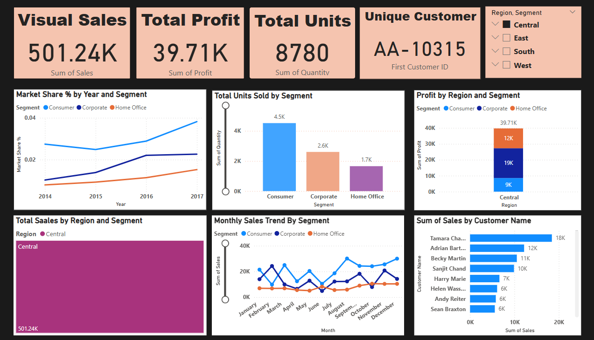

# 📊 Sales Performance Dashboard

> A Power BI project visualizing sales performance vs. budget with conditional formatting, YoY growth, and KPIs across products, customers, and sales representatives.

---

## 🔍 Overview

This dashboard helps track and analyze:
- Actual vs. Budgeted Sales (Value)
- Surplus/Deficit and Performance %
- Year-on-Year (YoY) Growth for Products and Customers
- Conditional formatting to flag under/over-performance

Built with **Power BI**, using data cleaning, DAX measures, and custom visuals.

---

## 📁 Files Included

| File | Description |
|------|-------------|
| `powerbi dashboard project.pbix` | Main Power BI dashboard file |
| `Assets/Superstore_Dashboard.png` | Dashboard image preview |
| `Assets/Business Insights Project Video.mp4` | Optional walkthrough of the dashboard |

---

## ▶️ Preview

> Click on the image to play the walkthrough video if video doesn't opens then please download and run it locally.

---

## 🛠 Tools & Skills Used

- Power BI
- DAX (Data Analysis Expressions)
- Data Modeling
- Data Cleaning & Transformation
- Visualization & Storytelling

---

## 📬 Contact

**Namrata Joshi**  
_Data Analyst_  
📧 njpareek256@gmail.com  
🌐 [LinkedIn](https://www.linkedin.com/in/namrata-pareek-3415b521b/)

---

⭐ _If you like this project, feel free to star this repo or connect with me!_
